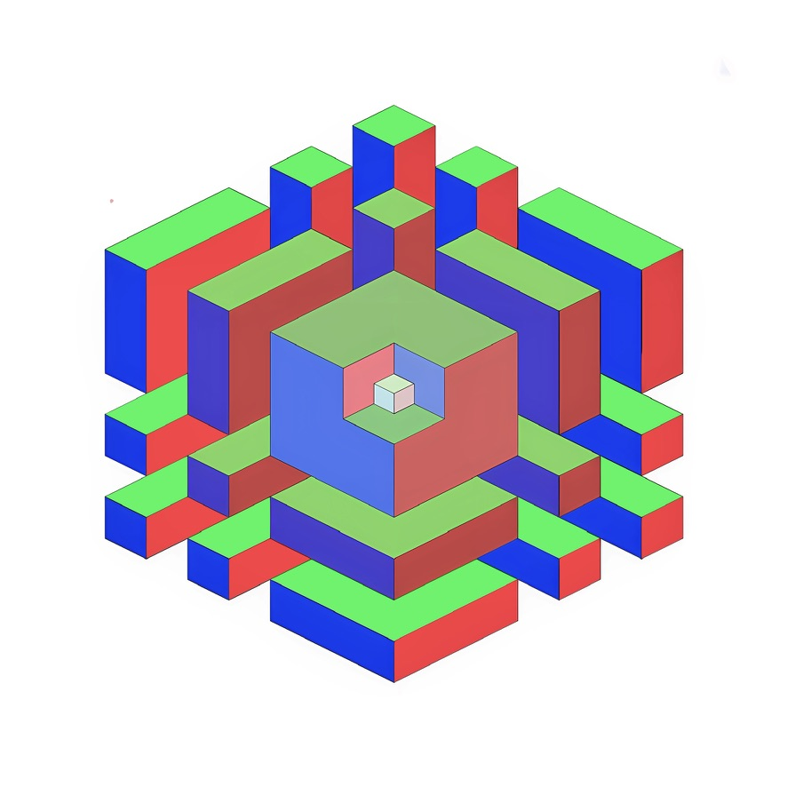
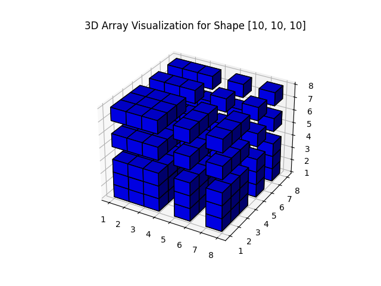

# Multi-dimensional Array Generator and Visualizer

This Python script generates and visualizes multi-dimensional arrays based on user-defined dimensions and sizes. The array elements are determined by specific rules and conditions.

## Functions

### Function `f(x)`

The function `f` maps a natural number to either `'n'` or `'e'` based on the following rules:
- `f(x) = 'n'` if `x ∈ {1, 2, 3, 5, 7}`
- `f(x) = 'e'` if `x ∈ {0, 4, 6, 8, 9}`

### Function `S_d(coords)`

The function `S_d` determines the value of a multi-dimensional coordinate based on the `f` function:
- `S_d(coords) = 'e'` if any element in `coords` results in `'e'` when passed through `f`
- `S_d(coords) = 'n'` otherwise

### Function `G_d(shape)`

The function `G_d` generates a multi-dimensional array with the specified shape. Each element of the array is determined by the `S_d` function.

## Usage

1. Install required packages:
   ```sh
   pip install numpy matplotlib
   ```

2. Run the script:
   ```sh
   python script.py
   ```

3. Follow the prompts to enter the number of dimensions and the size of each dimension.

### Example

For a 2x2x2x2 (4D) array, you would input:
```
Enter the number of dimensions: 4
Enter the size of dimension 1: 2
Enter the size of dimension 2: 2
Enter the size of dimension 3: 2
Enter the size of dimension 4: 2
```

The script will then generate and display the array.

## Visualization

- For 2D arrays, the script uses `matplotlib` to display the array as an image.
- For 3D arrays, the script uses `matplotlib` to display a 3D voxel plot.
- For 4D and higher-dimensional arrays, the script visualizes 2D slices of the array.

### Notes

- The script only visualizes 2D and 3D arrays directly.
- For higher-dimensional arrays, only 2D slices are visualized.
- Ensure all dimension sizes are positive integers.

## Example Code

```python
import numpy as np
import matplotlib.pyplot as plt

# Define the f function
def f(x):
    if x in {1, 2, 3, 5, 7}:
        return 'n'
    else:
        return 'e'

# Define the S_d function
def S_d(coords):
    for x in coords:
        if f(x) == 'e':
            return 'e'
    return 'n'

# Define the G_d function
def G_d(shape):
    it = np.nditer(np.zeros(shape), flags=['multi_index'])
    result = np.empty(shape, dtype=str)
    for _ in it:
        coords = it.multi_index
        result[coords] = S_d(coords)
    return result

# Get user input
dims = int(input("Enter the number of dimensions: "))
if dims <= 0:
    raise ValueError("Number of dimensions must be a positive integer.")

shape = []
for i in range(dims):
    size = int(input(f"Enter the size of dimension {i+1}: "))
    if size <= 0:
        raise ValueError("Dimension size must be a positive integer.")
    shape.append(size)

# Generate the array
result_array = G_d(shape)
print(result_array)

# Visualization
if dims == 2:
    plt.imshow(result_array == 'n', cmap='binary')
    plt.title("2D Array Visualization")
    plt.show()
elif dims == 3:
    fig = plt.figure()
    ax = fig.add_subplot(111, projection='3d')
    x, y, z = np.indices((shape[0], shape[1], shape[2]))
    ax.voxels(result_array == 'n', facecolors='blue', edgecolors='k')
    plt.title("3D Array Visualization")
    plt.show()
else:
    # For dimensions 4 and higher, visualize 2D slices
    fig, axes = plt.subplots(shape[0], shape[1], figsize=(shape[1] * 2, shape[0] * 2))
    for i in range(shape[0]):
        for j in range(shape[1]):
            ax = axes[i, j]
            slice_2d = result_array[i, j] if dims == 4 else result_array[i, j, 0]
            ax.imshow(slice_2d == 'n', cmap='binary')
            ax.set_title(f'Slice {i+1},{j+1}')
            ax.axis('off')
    plt.suptitle("2D Slices of Higher Dimensional Array")
    plt.show()
```

## License

This project is licensed under the MIT License.
